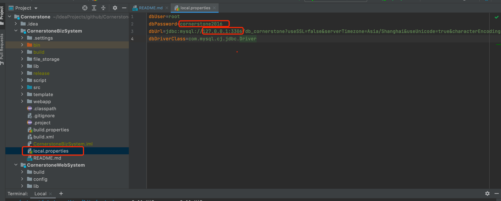
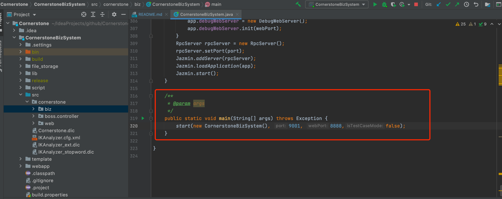
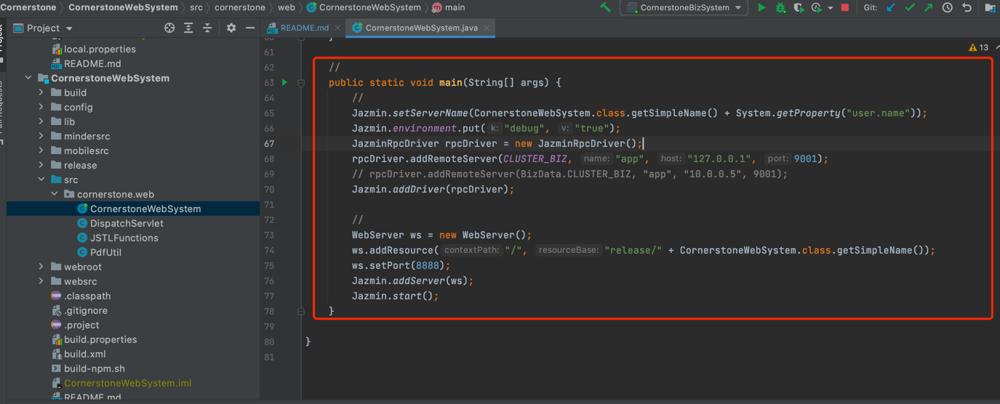
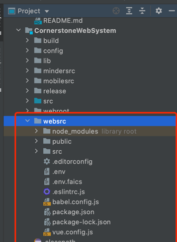
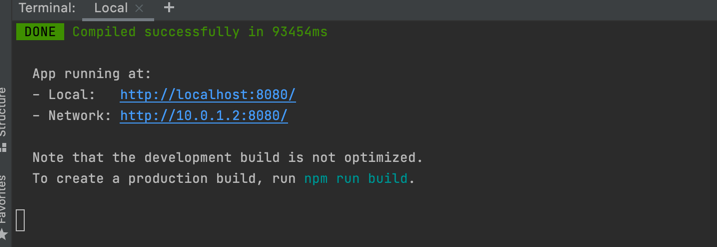
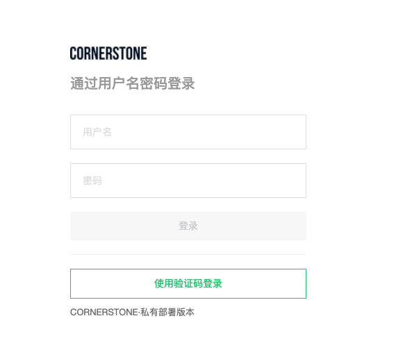
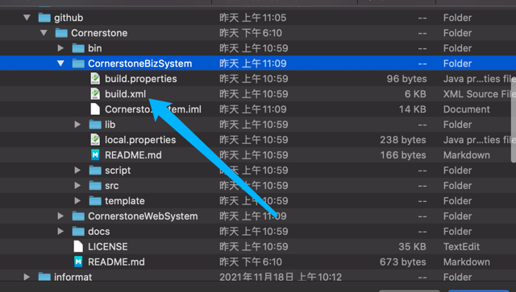
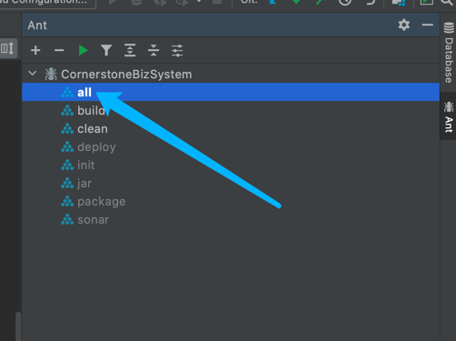
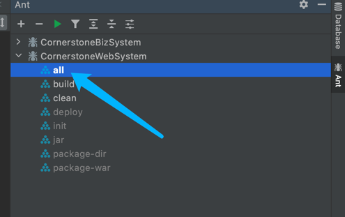

# Cornerstone
新一代项目管理工具


## 环境依赖

* 使用jdk10
* 项目采用ant管理jar包和构建项目
  
- 数据库mysql5.7, 请安装mysql

## 一键自动安装

```
$ curl -sL http://install.cornerstone365.cn/github/script/install_cs_mysql.sh | sudo bash -
```
* 网页验证是否部署成功: http://[ip]:8888
* [操作指导](#guidance)

## 上手指南

- [创建数据库](docs/db/数据库初始化手册.md)

- 本地数据库连接配置:<br>
  Cornerstone/CornerstoneBizSystem/local.properties
  
- Biz服务启动类:<br>
  Cornerstone/CornerstoneBizSystem/src/cornerstone/biz/CornerstoneBizSystem.java
  
- WEB服务启动类:<br>
  Cornerstone/CornerstoneWebSystem/src/cornerstone/web/CornerstoneWebSystem.java
  
- Web前端目录:<br>
  Cornerstone/CornerstoneWebSystem/websrc/<br>
  
- 本地启动:
> 查看下面本地启动
## 项目目录结构描述
```
│ Cornerstone
├─docs 文档目录
│  ├─db    	数据库文档目录
│  └─mannual    用户操作手册
├─CornerstoneBizSystem 业务系统
│  └─src  业务系统源码目录
└─CornerstoneWebSystem Web系统
   └─websrc Web系统源码目录      
```

## 本地启动
> 启动前先查看上手指南
* 修改Biz服务local.properties数据库配置信息
* 启动Biz服务
* 启动web前端
* 进入 Cornerstone/CornerstoneWebSystem/websrc 
  > 如果没有安装node.js 请先安装node.js https://nodejs.org/
* 启动服务
````
$ npm i 
$ npm run serve
````

* 登录页面 （默认账号密码 root ITITitit666）<br>
<br>
* [操作指导](#guidance)

## 编译
* 选择ant build.xml (CornerstoneBizSystem/build.xml、 CornerstoneWebSystem/build.xml)

* ant构造Biz工程<br>

* 验证是否构造成功 验证文件：CornerstoneBizSystem/release/CornerstoneBizSystem.jaz
* 编译WEB(CornerstoneBebSystem/websrc)
````
$ npm i
$ npm run build
````
* ant构造web工程(等待biz ant构造完成)<br>

* 验证是否构造成功 验证文件：CornerstoneWebSystem/release/CornerstoneWebSystem.war
* 将CornerstoneBizSystem.jaz、CornerstoneWebSystem.war上传至linux系统
## Linux部署
* 获取cs目录结构
````
$ curl -O http://install.cornerstone365.cn/github/install/cshome.tar.gz
````
* 解压cs目录至服务器根目录
````
$ tar -zxvf cshome.tar.gz -C /
````
* 将CornerstoneBizSystem.jaz放在目录：/cshome/jazmin_server_jdk10/instance/CornerstoneBizSystem
* 将CornerstoneWebSystem.war放在目录：/cshome/jazmin_server_jdk10/instance/CornerstoneWebSystem
* 修改mysql连接配置: /cshome/jazmin_server_jdk10/instance/CornerstoneBizSystem/jazmin.js
* 启动cornerstone
* 网页验证是否部署成功: http://[ip]:8888
````
$ cd /cshome/jazmin_server_jdk10/
$ ./restartall.sh
````
<a id="guidance"></a>
## 操作指导
> 社区: https://bbs.cornerstone365.cn/

> 帮助文档：  https://www.cornerstone365.cn/doc/  

> 上手视频： https://www.cornerstone365.cn/videos.html

* 登录系统: http://[ip]:8888
## 联系我们
* 深圳市基石协作科技有限公司
* 地址：深圳市南山区粤海街道深圳湾生态园7B-812
* 座机：400-185-5850
* 手机：16675114379
* 邮箱: sales@conrerstone365.cn<br>

