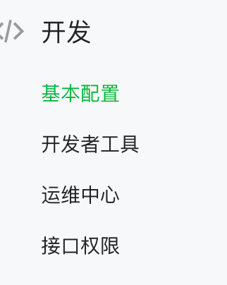
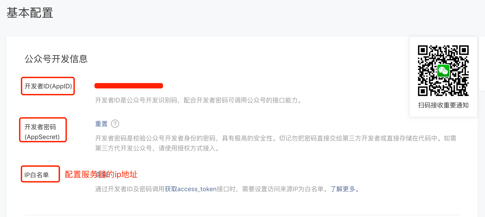
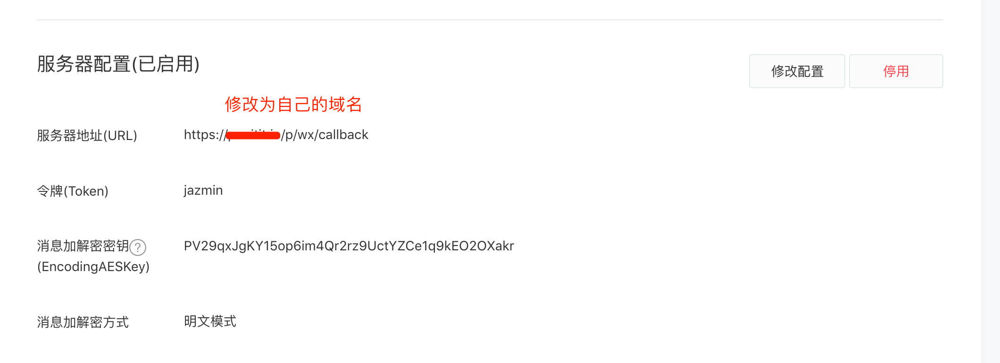
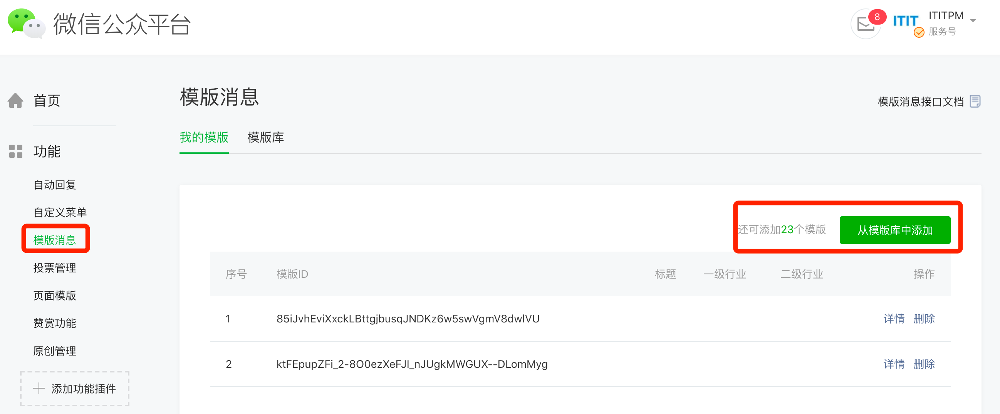
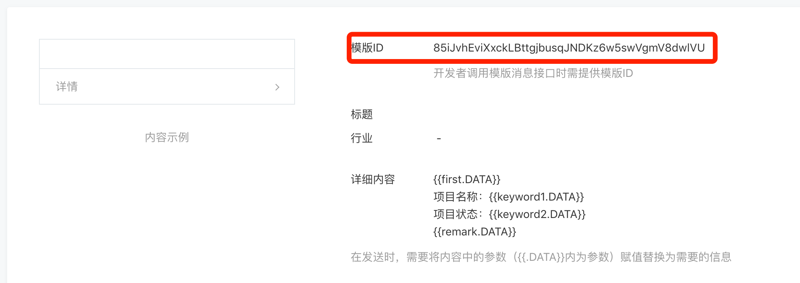
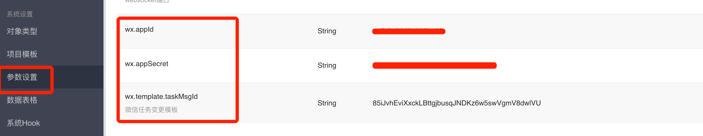
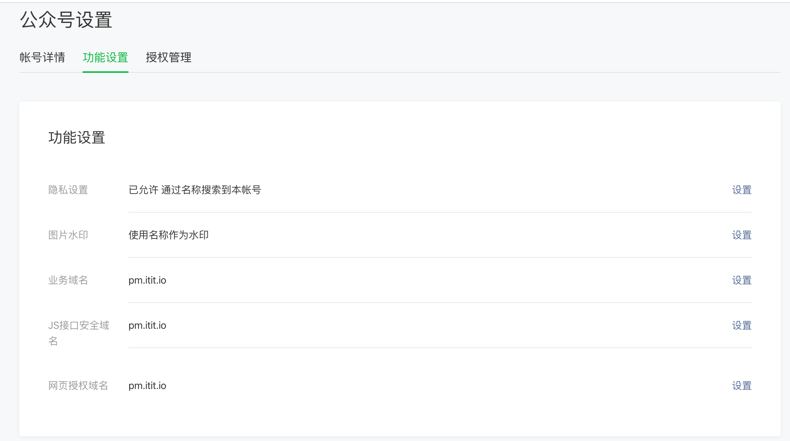

### 1.通过公众号后台https://mp.weixin.qq.com，拿到公众号的appId，appSecret 

### 2.微信公众号后台启用服务器配置

### 3.在微信公众号后台新增模板消息，拿到模板消息ID

### 4.把前三步获得的appId，appSecret，模板消息ID设置到CORNERSTONE的参数配置里

### 5.公众号设置里在业务域名里设置好域名

